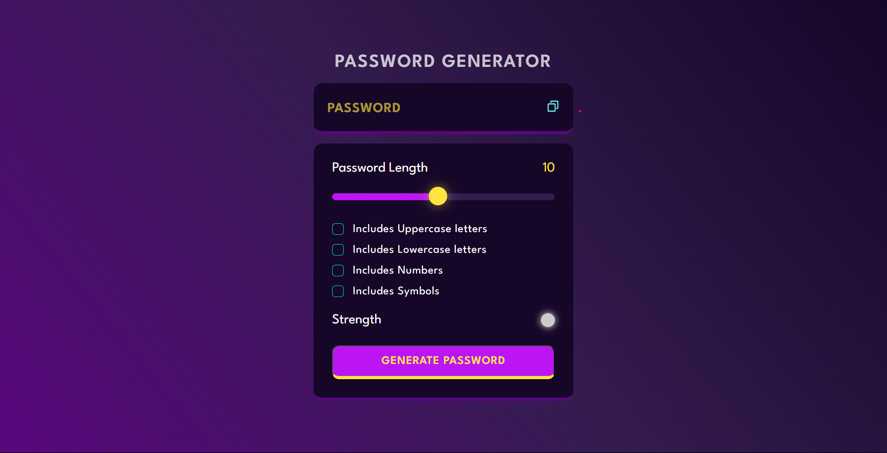
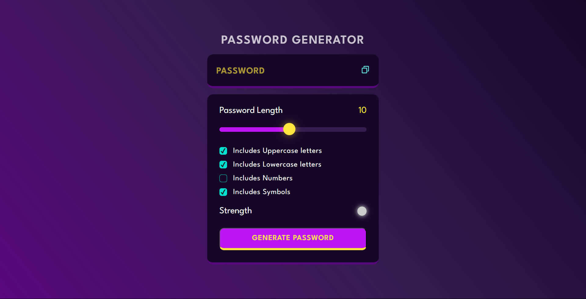
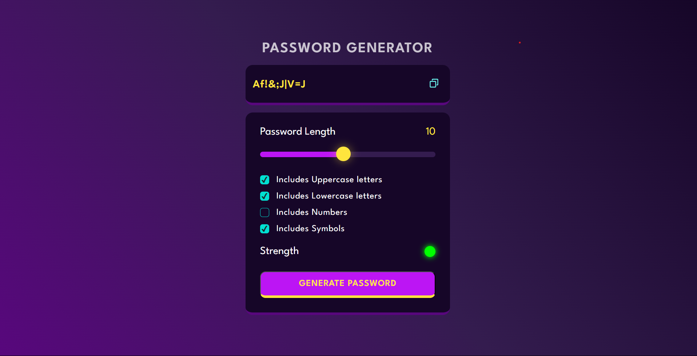

# Random Password Generator

A Random Password Generator website built with HTML, Tailwind CSS, and JavaScript. This project was created to enhance my web development skills, particularly in building user interfaces and implementing randomization algorithms. The website allows users to generate random passwords based on their preferences and provides a password strength assessment.





## Table of Contents

- [Overview](#overview)
- [Installation](#installation)
- [Usage](#usage)
- [Technologies Used](#technologies-used)
- [Contributing](#contributing)
- [License](#license)

## Overview

The Random Password Generator website enables users to create customized random passwords according to their specifications. It offers the following features:

- Password length customization (1 to 20 characters).
- Option to include uppercase letters.
- Option to include lowercase letters.
- Option to include numbers.
- Option to include symbols.

The website leverages the **Fisher-Yates algorithm** to generate random passwords based on the selected criteria. Additionally, it assesses the strength of the generated password using backend logic and industry standards.

## Installation

1. Clone the repository:

   ```bash
   git clone https://github.com/sargunkohli152/Password-Generator.git
2. Open the index.html file in a web browser to use the password generator.

## Usage
1. Open the website in a web browser.
2. Customize your password preferences by selecting options:
   - Password Length (1 to 20 characters).
   - Include Uppercase Letters.
   - Include Lowercase Letters.
   - Include Numbers.
   - Include Symbols.
3. Click the "Generate Password" button to generate a random password based on your preferences.
4. The generated password will be displayed on the screen, along with its strength assessment.

## Technologies Used
 - HTML
 - Tailwind CSS
 - JavaScript

## Contributing
Contributions are welcome! If you have any suggestions, improvements, or want to add new features, please fork the project, make your changes, and submit a pull request.

## License
MIT License

Permission is hereby granted, free of charge, to any person obtaining a copy of this software and associated documentation files (the "Software"), to deal in the Software without restriction, including without limitation the rights to use, copy, modify, merge, publish, distribute, sublicense, and/or sell copies of the Software, and to permit persons to whom the Software is furnished to do so, subject to the following conditions:

The above copyright notice and this permission notice shall be included in all copies or substantial portions of the Software.

THE SOFTWARE IS PROVIDED "AS IS", WITHOUT WARRANTY OF ANY KIND, EXPRESS OR IMPLIED, INCLUDING BUT NOT LIMITED TO THE WARRANTIES OF MERCHANTABILITY, FITNESS FOR A PARTICULAR PURPOSE AND NONINFRINGEMENT. IN NO EVENT SHALL THE AUTHORS OR COPYRIGHT HOLDERS BE LIABLE FOR ANY CLAIM, DAMAGES OR OTHER LIABILITY, WHETHER IN AN ACTION OF CONTRACT, TORT OR OTHERWISE, ARISING FROM, OUT OF OR IN CONNECTION WITH THE SOFTWARE OR THE USE OR OTHER DEALINGS IN THE SOFTWARE.
